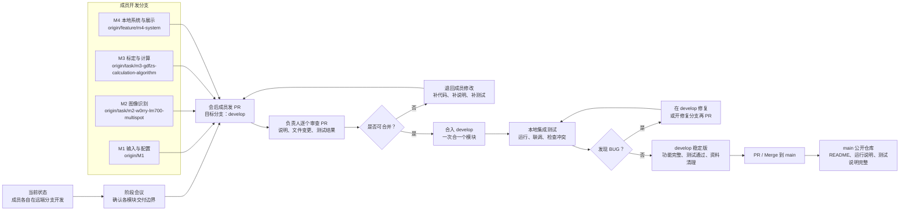
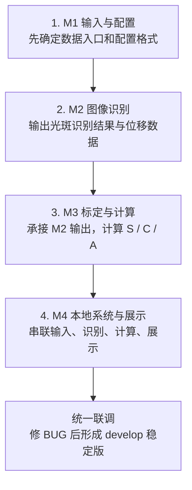

# 阶段会议开发流程图

> **历史会议记录**：本文记录 2026-08-01 阶段会议时的计划和分支状态，已不代表当前仓库进度。2026-08-07 的实际状态、第一步/第二步安排和当前分支规则见仓库根 `README.md`；不得继续使用下文列出的旧任务分支。

> 会议日期：2026-08-01
> 用途：说明当前成员分支开发状态，以及会后 PR、集成、修 BUG、发布 `main` 的节奏。

## 一句话说明

当前成员主要在各自分支开发。阶段会后，成员将把阶段成果通过 PR 提交到 `develop`，负责人逐个审查、合并、联调和修 BUG。等 `develop` 稳定后，再合入 `main`，作为公开仓库版本。

## 主流程图

## 推荐合并顺序

## 会上可以这样讲

1. 现在不是直接往 `main` 提交，而是成员先在自己的远端分支完成模块开发。
2. 今天会后，每个成员把阶段成果发 PR 到 `develop`，PR 里要写清楚做了什么、怎么运行、怎么验证。
3. 合并时不要一次性全合，建议按 M1、M2、M3、M4 的依赖顺序逐个合并。
4. 每合一个模块就在 `develop` 上跑一次集成检查，发现 BUG 就在 `develop` 或修复分支处理。
5. 只有当 `develop` 功能完整、测试通过、资料清理完成后，才合入 `main` 作为公开版本。

## 当前分支判断

- M1 当前主要看：`origin/M1`
- M2 当前主要看：`origin/task/m2-w0rry-lm700-multispot`
- M3 当前主要看：`origin/task/m3-gdfzs-calculation-algorithm`
- M4 当前暂未看到新提交，后续看成员是否补 PR 到 `develop`

## 会后检查清单

- 每个 PR 是否说明负责模块、核心改动、运行方式和测试结果。
- 是否误提交本地资料、临时输出、内部文件或大文件。
- 是否和其他模块的输入输出格式一致。
- 合并后 `develop` 是否能完整跑通。
- `main` 公开前 README、运行说明、依赖说明、测试说明是否齐全。
